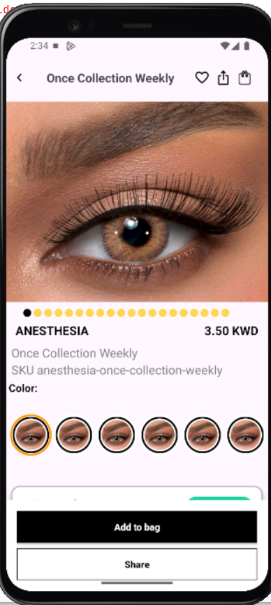
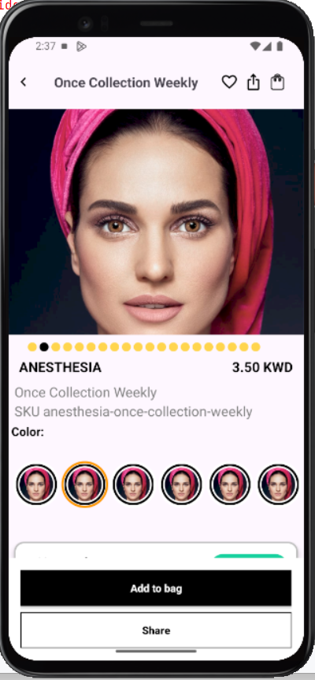
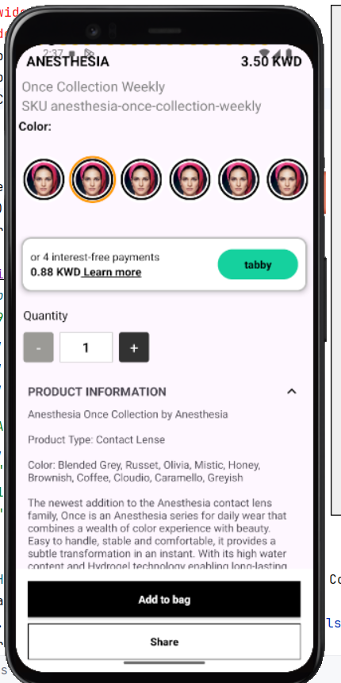

# 📱 Android Product Viewer App

This app is built using **Kotlin**, **MVVM architecture**, and **Retrofit** to fetch and display product data from a REST API. It offers a clean UI and a responsive user experience.

---

## 🚀 Features

- 📡 Fetch product data using Retrofit
- 🧭 Clean and modern UI
- 🔄 View data in realtime with LiveData
- 🧱 MVVM architecture
- 🖼 Display images and product details

---

## 📸 Screenshots

|  |  |  |  |
|:----------------------------:|:-----------------------------:|:-----------------------------:|:---------------------------:|
| Home Screen                 | Product List                 | Product Detail               | Add Product                |

---

----Tech Stack
-Kotlin
-MVVM
-Retrofit
-LiveData
-ViewModel
-XML UI Design

👨‍💻 Developed By
Premm Chand